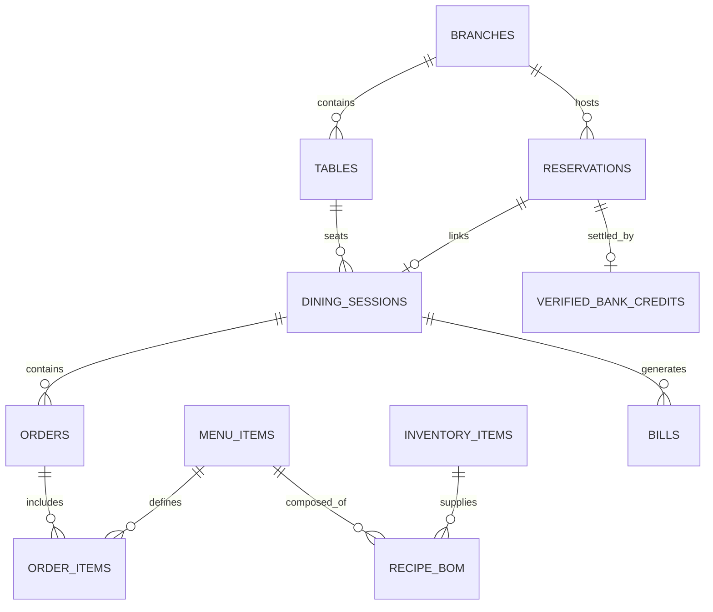

# 🏗️ Jaadoo Café Piza — Complete Technical Architecture & System Lifecycle

> **System Core Philosophy:**  
> - **PostgreSQL** is the **Single Source of Truth** for all financial, inventory, order, and reservation states.
> - **Redis** serves as an ephemeral layer for **distributed caching, live pub/sub events, and rate limiting**.
> - **Single Kitchen Operations (ONE Kitchen, NO KDS)**: Physical Kitchen Order Tickets (KOT) are printed directly to thermal receipt printers at the kitchen station. No kitchen display screens (KDS) are required or used.

---

## 🧭 End-to-End Execution Flow

```mermaid
flowchart TD
    subgraph Frontend_Layer ["1. Frontend Layer (Next.js 14 / App Router)"]
        A1["Customer Reservation Flow (/book-table)"]
        A2["Customer Table QR Ordering (/table/[id])"]
        A3["Staff POS & Captain Billing (/pos)"]
    end

    subgraph Reservation_Layer ["2. Reservation Engine (Deposit & Hold)"]
        B1["Capacity & Slot Check (Branch Rules)"]
        B2["₹200/Guest Deposit Calculation (Decimal)"]
        B3["7-Min Atomic Hold & UPI QR Generation"]
        B4["Bank Webhook / iOS-Android Payment Event"]
        B5["Reservation Confirmed (PAID)"]
    end

    subgraph Session_Layer ["3. Dining Session (Table Lifecycle)"]
        C1["Customer Check-in / Table Assignment"]
        C2["Atomic DiningSession (ACTIVE)"]
        C3["Session Token Bound to Table & Reservation"]
    end

    subgraph Order_Layer ["4. OrderService (Transaction Coordinator)"]
        D1["POST /api/v1/orders (DB Transaction Start)"]
        D2["Price & Availability Verification"]
    end

    subgraph Capacity_Layer ["5. CapacityService (Oven Protection)"]
        E1["Hourly Woodfired Oven Limit Check"]
        E2["Atomic Hourly Window Allocation"]
        E3["Rejection with PIZZA_SOLD_OUT if Exceeded"]
    end

    subgraph Inventory_Layer ["6. InventoryService (BOM Deduction)"]
        F1["Recipe / Bill of Materials (BOM) Lookup"]
        F2["Stock Availability Validation"]
        F3["Atomic Ingredient Deduction & Audit Log"]
    end

    subgraph KOT_Layer ["7. Kitchen Engine (KOT Generation)"]
        G1["Sequential KOT Number Generation"]
        G2["KOT Record Insertion (Status: PENDING)"]
    end

    subgraph Printing_Layer ["8. Thermal Printer Driver (ONE Kitchen - NO KDS)"]
        H1["Render Formatted ESC/POS Raw Data"]
        H2["Network (TCP/9100) or Serial/Bluetooth Print"]
        H3["Physical Ticket Dispensed to Kitchen Chef"]
    end

    subgraph POS_Realtime_Layer ["9. POS & WebSocket Real-time Sync"]
        I1["Redis Pub/Sub Event Broadcast ('kitchen_channel', 'pos_channel')"]
        I2["Live POS UI Refresh via WebSocket"]
        I3["Bill Generation with Automatic Reservation Deposit Credit"]
    end

    Frontend_Layer --> Reservation_Layer
    Reservation_Layer --> Session_Layer
    Session_Layer --> Order_Layer
    Order_Layer --> Capacity_Layer
    Capacity_Layer --> Inventory_Layer
    Inventory_Layer --> KOT_Layer
    KOT_Layer --> Printing_Layer
    Printing_Layer --> POS_Realtime_Layer
```



---

## 1. Frontend Architecture (`Next.js 14 / TailwindCSS / Lucide`)

The frontend is divided into three distinct operational domains:

1. **Customer Reservation Portal (`/book-table`)**:
   - Step 1: Selects Date, Time Slot, and Number of Guests.
   - Automatically computes non-editable reservation deposit (`₹200 × guest_count`).
   - Step 2: Live 7-minute countdown hold with dynamic UPI QR (`upi://pay?pa=...&am=...&tn=TableRes_<id>`).
   - Step 3: Polling / WebSocket listener transitions seamlessly to confirmed booking pass upon payment verification.

2. **Table QR Dining & Self-Ordering (`/table/[id]?token=...`)**:
   - Scanned via tabletop QR cards (e.g. Table 2, Floor 1).
   - Validates active `DiningSession` token.
   - Categorized woodfired pizza, beverage, and dessert menus with real-time sold-out badges.
   - Real-time order submission straight into the order pipeline.

3. **POS & Staff Billing Terminal (`/pos`)**:
   - Role-based access control (Admin, Manager, Cashier, Captain).
   - Real-time floor plan visualization (Table status: `AVAILABLE`, `OCCUPIED`, `BILL_PRINTED`, `RESERVED`).
   - Order management, KOT reprint capabilities, and bill settlement with reservation deposit credit deductions.

---

## 2. Reservation & Payment Verification Engine

### Deposit & Pricing Rules
* **Minimum Deposit**: Strictly **₹200.00 per person**, calculated using `Decimal` / `NUMERIC(10,2)` on the backend.
* **Slot Locking**: A 7-minute atomic lock (`hold_expires_at = NOW() + 7 minutes`) prevents double-booking of restaurant capacity.
* **Direct Bank UPI Verification (0% Gateway Commission)**:
  - Generates direct merchant UPI QR (`9460555743-2@ybl`).
  - Webhook listener receives real-time bank settlement events from registered counter devices (iOS Shortcuts / Android Listener).
  - **Fraud Prevention**: Prevents customer-entered fake UTRs from confirming reservations. Reconciles exact 12-digit UTR, amount, and timestamp against `verified_bank_credits`.

### Deposit Remainder Policies (Configurable via `SettingsService`):
1. **`CUSTOMER_CREDIT` (Default)**: If the final dining bill is less than the deposit, the remaining balance is issued as customer store credit for future visits.
2. **`REFUND_REMAINDER`**: Unspent deposit balance is marked for direct bank refund.
3. **`FORFEIT_REMAINDER`**: Unspent deposit balance is retained as reservation service charge.

---

## 3. Table & DiningSession Lifecycle

```
[ AVAILABLE ] ──(Customer Check-In / Hold Claimed)──> [ OCCUPIED ]
                                                            │
                                                     (Place Orders)
                                                            │
                                                            ▼
[ AVAILABLE ] <──(Bill Paid & Settled)── [ BILL_PRINTED / SETTLING ]
```

- Each table occupancy creates a unique `DiningSession` (`id`, `table_id`, `reservation_id`, `guest_count`, `session_token`, `status='ACTIVE'`).
- The session links all ongoing `Order`, `OrderItem`, and `KOT` records to the table until final checkout.
- Prevents concurrent sessions on the same physical table through database unique partial index constraints.

---

## 4. Order Processing Pipeline (`OrderService`)

When an order request hits `POST /api/v1/orders`, the backend executes an **atomic database transaction**:

```python
async with db.begin():
    # 1. Lock Dining Session
    session = await db.get(DiningSession, session_id, with_for_update=True)
    
    # 2. Iterate each item:
    for item in order_items:
        # A. Validate & Allocate Production Capacity (Oven Limits)
        await CapacityService.validate_and_allocate(db, item.menu_item_id, item.qty)
        
        # B. Validate & Deduct Inventory BOM Stock
        await InventoryService.deduct_bom_stock(db, item.menu_item_id, item.qty, order_number)
        
    # 3. Create Order & OrderItem records
    # 4. Generate Kitchen Order Ticket (KOT)
    # 5. Emit Redis Event to Trigger Thermal Print & POS Sync
```

If **any** step fails (e.g. insufficient cheese, oven at max capacity, invalid session), the transaction is **rolled back 100%**, preventing inconsistent database states or partial orders.

---

## 5. Capacity Protection Engine (`CapacityService`)

Woodfired pizza ovens have physical limits on how many pizzas can be baked per hour without degrading crust quality or causing massive order delays.

* **Batch Capacity Validation**:
  - Checks current hour's allocated pizza count for the branch.
  - If `current_hourly_count + new_qty > max_hourly_capacity`:
    - Rejects order immediately with error code `PIZZA_SOLD_OUT` or `CAPACITY_EXCEEDED`.
  - Ensures dine-in quality and prevents kitchen bottlenecks during rush hours.

---

## 6. Inventory & Recipe BOM System (`InventoryService`)

Each menu item has a defined **Bill of Materials (BOM)** mapping ingredients to exact quantities:

```
Margherita Pizza (1 Unit)
├── Pizza Dough Ball: 1.0 Unit (220g)
├── San Marzano Tomato Sauce: 80.0 ml
├── Fresh Mozzarella / Fior di Latte: 100.0 g
├── Fresh Basil Leaves: 4.0 leaves
└── Extra Virgin Olive Oil: 10.0 ml
```

* **Atomic Stock Check & Deduction**:
  - Uses `SELECT ... FOR UPDATE` on `inventory_items` to avoid race conditions.
  - Automatically raises `INSUFFICIENT_STOCK` if any required ingredient is below the required quantity.
  - Generates an immutable `inventory_transactions` record for reconciliation and waste tracking.

---

## 7. Kitchen Engine & Single Thermal Printer Architecture

### ❌ NO Kitchen Display Screens (No KDS)
Jaadoo Café utilizes a **Single Kitchen** architecture driven entirely by physical **Thermal KOTs**:

```
[ Order Confirmed ] ──> [ KOT Record in DB ] ──> [ Thermal Printer Worker ] ──> [ 80mm ESC/POS Paper Ticket ]
```

### Physical KOT Formatting:
* **Header**: Restaurant Name, Table Number, Floor, Waiter/Self-Order indicator, KOT Sequence Number (`KOT #14`), Timestamp.
* **Itemized List**: Item Name, Quantity in large bold typography, and Special Cooking Instructions (e.g., *"Extra crispy base", "No garlic"*).
* **Footer**: Cut line with automatic paper cut command (`GS V 66 0`).

### Thermal Printer Connectivity:
* **Primary**: Network TCP/IP (`ESC/POS` over Socket on Port `9100`).
* **Fallback**: USB Serial or Bluetooth Thermal Slip Printer connected to POS base terminal.
* **Idempotency**: Every KOT has a unique hash and print status (`PENDING`, `PRINTED`, `FAILED`). Reprints are explicitly stamped **`*** DUPLICATE REPRINT ***`**.

---

## 8. POS & Real-Time Sync Layer (`Redis + WebSockets`)

1. **Redis Pub/Sub Channels**:
   - `cafe:orders`: Broadcasts newly created and updated orders.
   - `cafe:tables`: Broadcasts table state transitions (`OCCUPIED`, `BILL_PRINTED`, `CLEARED`).
   - `cafe:kot`: Triggers printer spooler daemon.
2. **WebSocket Manager (`/api/v1/ws`)**:
   - Maintains authenticated live WebSocket connections with POS terminals and staff tablets.
   - Pushes instantaneous UI updates without client polling.

---

## 9. Database Schema (PostgreSQL Source of Truth)

### Core Tables & Relationships



### Key Table Responsibilities:

| Table Name | Primary Purpose | Key Constraints |
| :--- | :--- | :--- |
| `reservations` | Advance bookings & slot locking | `hold_expires_at`, `guest_count`, `advance_amount` |
| `verified_bank_credits` | Authentic UPI settlements (from Webhook) | `utr` (UNIQUE), `is_claimed`, `status` |
| `dining_sessions` | Active customer table occupancy | `table_id`, `session_token`, `status='ACTIVE'` |
| `orders` | Customer order header | `session_id`, `order_number` (UNIQUE), `total_amount` |
| `order_items` | Individual dishes ordered with notes | `order_id`, `menu_item_id`, `quantity` |
| `kots` | Physical kitchen tickets | `kot_number`, `print_status`, `order_id` |
| `bills` | Final guest invoice & tax computation | `reservation_credit`, `net_amount`, `payment_status` |
| `inventory_items` | Raw ingredient stock ledger | `current_stock`, `unit_of_measure`, `minimum_threshold` |
| `recipe_boms` | Ingredient mappings per menu item | `menu_item_id`, `inventory_item_id`, `quantity_required` |

---

## 10. Fault Tolerance & Edge Case Safeguards

| Scenario | System Protection Behavior |
| :--- | :--- |
| **Fake / Spoofed UTR Entered** | Rejected with `400 Bad Request`. System only confirms bookings when matching UTR exists in `verified_bank_credits`. |
| **Duplicate / Replay Payment SMS** | Identified by `utr` / `event_id` unique constraint; returns `ALREADY_PROCESSED` with zero double crediting. |
| **Late Payment (After 7-Min Hold)** | Marked as `PAYMENT_REVIEW_REQUIRED` for staff ledger assignment instead of silently failing or dropping money. |
| **Sudden Pizza Rush Exceeds Oven** | `CapacityService` rejects excess orders with `PIZZA_SOLD_OUT`, preventing severe delays and oven degradation. |
| **Thermal Printer Out of Paper / Offline** | KOT status marked as `FAILED`. POS UI displays printer alert badge with one-click **Reprint KOT** action once paper is restored. |
| **Bill Less Than Reservation Deposit** | Policy engine calculates remainder balance, applying `CUSTOMER_CREDIT` / `REFUND` per café store configuration. |

---

## 11. Technology Stack Summary

* **Frontend**: Next.js 14 (App Router), React 18, TailwindCSS, Lucide Icons, Fetch / WebSocket.
* **Backend**: FastAPI (Python 3.11+), SQLAlchemy 2.0 (Asyncpg), Pydantic v2.
* **Primary Database**: PostgreSQL 16 (ACID, Row-Level Locking, High Concurrency).
* **Cache & Message Broker**: Redis 7.x (Pub/Sub, Distributed Locks, Rate Limiting).
* **Hardware Interop**: ESC/POS Network Socket Driver (Port 9100 / Raw Byte Streams).
